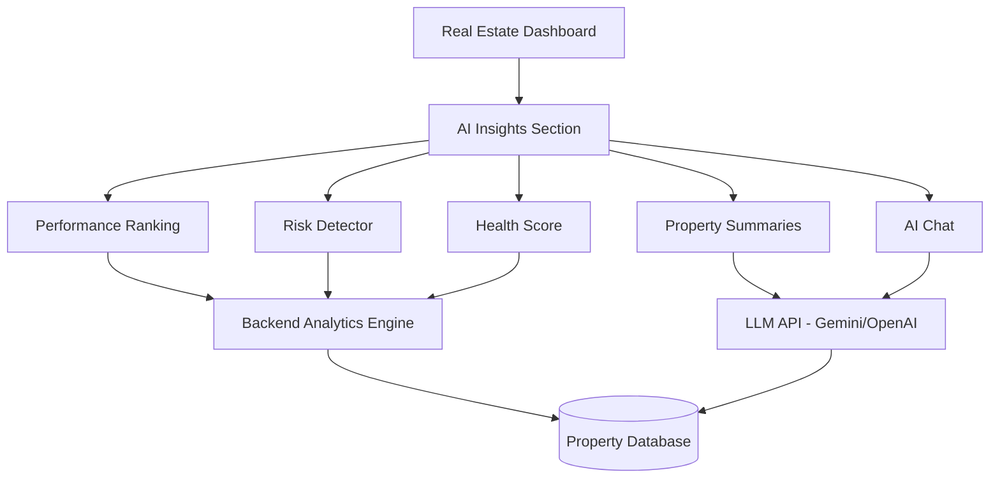

# Real Estate AI Insights - Implementation Plan

Complete technical roadmap for implementing AI-powered insights in the Real Estate module.

---

## Overview

Adding an **AI Insights** section to Real Estate that provides:
1. Property Performance Ranking
2. Smart Property Risk Detector
3. AI Health Score (0-100)
4. AI Property Summary Cards
5. Location Growth Intelligence
6. Real Estate AI Chat Assistant

---

## Architecture Overview



---

## Phase 1: Foundation (Week 1)

### Backend: Analytics Engine

#### New API Endpoints

##### `GET /api/real-estate/analytics/ranking`
Returns ranked properties by performance.

**Response:**
```json
{
  "rankings": [
    {
      "property_id": "uuid",
      "name": "Sunset Villa",
      "rank": 1,
      "performance_score": 92.5,
      "roi_percent": 15.2,
      "appreciation": 380000,
      "rental_yield": 2.1,
      "badge": "gold"
    }
  ],
  "insights": {
    "best_performer": "Sunset Villa",
    "worst_performer": "Downtown Apt",
    "performance_gap": "2.3x"
  }
}
```

**Algorithm:**
```python
performance_score = (
    roi_weight * roi_percent +
    growth_weight * appreciation_rate +
    yield_weight * rental_yield +
    cash_flow_weight * monthly_cash_flow
)
```

##### `POST /api/real-estate/analytics/health-score`
Calculates overall portfolio health.

**Request:**
```json
{
  "user_id": "uuid"
}
```

**Response:**
```json
{
  "overall_score": 78,
  "grade": "Strong",
  "breakdown": {
    "growth": 85,
    "risk": 72,
    "rental_yield": 68,
    "liquidity": 80
  },
  "recommendations": [
    "Consider diversifying into Tier-2 cities",
    "Property B is underperforming - review pricing"
  ]
}
```

**Calculation Logic:**
```python
def calculate_health_score(properties):
    growth_score = calculate_growth_metrics(properties)      # 40%
    risk_score = calculate_risk_metrics(properties)          # 20%
    yield_score = calculate_rental_yield(properties)         # 25%
    liquidity_score = calculate_liquidity(properties)        # 15%
    
    overall = (
        growth_score * 0.40 +
        risk_score * 0.20 +
        yield_score * 0.25 +
        liquidity_score * 0.15
    )
    return round(overall)
```

##### `POST /api/real-estate/analytics/risk-detection`
Detects property-level risks.

**Response:**
```json
{
  "property_id": "uuid",
  "risks": [
    {
      "type": "overpriced",
      "severity": "medium",
      "confidence": 0.72,
      "message": "Purchase price 18% above market average"
    },
    {
      "type": "low_rental_demand",
      "severity": "low",
      "confidence": 0.65,
      "message": "Rental yield below portfolio average"
    }
  ],
  "risk_score": 35
}
```

---

### Frontend: UI Structure

#### New Section in Dashboard

Add after "Valuations & Documents" section:

```html
<!-- AI Insights Section -->
<section id="real-estate-ai-insights" class="dashboard-section">
    <div class="section-header">
        <h2>🤖 AI Insights</h2>
        <p class="text-white-50">Intelligent analysis of your real estate portfolio</p>
    </div>
    
    <div id="ai-insights-content">
        <!-- Dynamic content loaded here -->
    </div>
</section>
```

#### Component Structure

```
frontend/
├── js/
│   ├── dashboard.js
│   └── real-estate-ai.js          [NEW]
├── css/
│   └── ai-insights.css            [NEW]
└── dashboard.html
```

---

## Phase 2: Core Features (Week 2)

### Feature 1: Property Performance Ranking

#### UI Design

**Visual:** Podium-style cards with medals

```html
<div class="performance-ranking-container">
    <div class="ranking-podium">
        <!-- Top 3 Properties -->
        <div class="rank-card gold">
            <span class="medal">🥇</span>
            <h3>Sunset Villa</h3>
            <div class="metric">ROI: +15.2%</div>
            <div class="score">Score: 92.5/100</div>
        </div>
    </div>
    
    <div class="ranking-list">
        <!-- Remaining properties -->
    </div>
    
    <div class="ranking-insights">
        <p class="insight-text">
            💡 Sunset Villa is outperforming Downtown Apt by <strong>2.3x</strong>
        </p>
    </div>
</div>
```

**CSS Styling:**
```css
.rank-card.gold {
    background: linear-gradient(135deg, rgba(255,215,0,0.1), rgba(255,215,0,0.05));
    border: 2px solid rgba(255,215,0,0.3);
    box-shadow: 0 0 30px rgba(255,215,0,0.2);
}

.medal {
    font-size: 3rem;
    animation: bounce 2s infinite;
}
```

---

### Feature 2: AI Health Score

#### UI Design

**Visual:** Large circular progress indicator

```html
<div class="health-score-card glass-card p-4">
    <h3 class="mb-4">Portfolio Health Score</h3>
    
    <div class="score-circle-container">
        <svg class="score-circle" viewBox="0 0 200 200">
            <circle class="bg-circle" cx="100" cy="100" r="90"/>
            <circle class="progress-circle" cx="100" cy="100" r="90" 
                    stroke-dasharray="565.48" 
                    stroke-dashoffset="141.37"/>
        </svg>
        <div class="score-value">
            <span class="score-number">78</span>
            <span class="score-label">Strong</span>
        </div>
    </div>
    
    <div class="score-breakdown">
        <div class="breakdown-item">
            <span>Growth</span>
            <div class="progress-bar">
                <div class="progress-fill" style="width: 85%"></div>
            </div>
            <span>85/100</span>
        </div>
        <!-- More breakdown items -->
    </div>
</div>
```

**Animation:**
```javascript
function animateHealthScore(score) {
    const circle = document.querySelector('.progress-circle');
    const radius = 90;
    const circumference = 2 * Math.PI * radius;
    const offset = circumference - (score / 100) * circumference;
    
    circle.style.strokeDashoffset = circumference;
    setTimeout(() => {
        circle.style.strokeDashoffset = offset;
    }, 100);
}
```

---

### Feature 3: Smart Risk Detector

#### UI Design

**Visual:** Alert cards with severity indicators

```html
<div class="risk-detector-container">
    <div class="risk-card severity-medium">
        <div class="risk-icon">⚠️</div>
        <div class="risk-content">
            <h4>Property: Downtown Apt</h4>
            <p class="risk-type">Overpriced Property</p>
            <p class="risk-message">
                Purchase price 18% above market average
            </p>
            <div class="risk-confidence">
                Confidence: <strong>72%</strong>
            </div>
        </div>
        <button class="btn-dismiss">Dismiss</button>
    </div>
</div>
```

**Risk Severity Colors:**
```css
.severity-high { border-left: 4px solid #ef4444; }
.severity-medium { border-left: 4px solid #f59e0b; }
.severity-low { border-left: 4px solid #10b981; }
```

---

## Phase 3: AI Layer (Week 3)

### Feature 4: AI Property Summary Cards

#### Integration: Google Gemini API

**Setup:**
```bash
pip install google-generativeai
```

**.env file:**
```
GEMINI_API_KEY=your_gemini_api_key_here
```

**Backend Implementation:**

```python
# backend/services/ai_service.py

import google.generativeai as genai
from typing import Dict

class AIInsightsService:
    def __init__(self, api_key: str):
        genai.configure(api_key=api_key)
        self.model = genai.GenerativeModel('gemini-pro')
    
    async def generate_property_summary(self, property_data: Dict) -> str:
        prompt = f"""
        Analyze this real estate property and create a concise one-line summary:
        
        Property Details:
        - Name: {property_data['name']}
        - Location: {property_data['location']}
        - Purchase Price: ₹{property_data['purchase_price']:,.0f}
        - Current Value: ₹{property_data['current_value']:,.0f}
        - Appreciation: {property_data['appreciation_percent']:.1f}%
        - Rental Income: ₹{property_data.get('rent_amount', 0):,.0f}/month
        - Rental Yield: {property_data.get('rental_yield', 0):.2f}%
        
        Instructions:
        - Classify risk level (low/mid/high)
        - Assess potential (low/moderate/high)
        - Categorize asset type (rental/appreciation/balanced)
        - Provide 3-5 year outlook (strong/moderate/weak)
        
        Format: "This is a [risk]-risk, [potential]-potential [type] asset with [outlook] outlook."
        
        Be concise, professional, and actionable.
        """
        
        response = self.model.generate_content(prompt)
        return response.text.strip()
```

**API Endpoint:**

```python
# backend/routers/real_estate.py

@router.post("/properties/{property_id}/ai-summary")
async def generate_ai_summary(
    property_id: str,
    current_user: User = Depends(get_current_user),
    db: Session = Depends(get_db)
):
    property_data = get_property_by_id(db, property_id, current_user.id)
    
    # Check cache first
    cached_summary = redis_client.get(f"summary:{property_id}")
    if cached_summary:
        return {"summary": cached_summary}
    
    # Generate new summary
    ai_service = AIInsightsService(settings.GEMINI_API_KEY)
    summary = await ai_service.generate_property_summary(property_data)
    
    # Cache for 24 hours
    redis_client.setex(f"summary:{property_id}", 86400, summary)
    
    return {"summary": summary}
```

**Frontend Display:**

```html
<div class="property-card">
    <div class="property-header">
        <h3>Sunset Villa</h3>
    </div>
    
    <div class="ai-summary-badge">
        <span class="ai-icon">✨</span>
        <p class="ai-summary-text">
            This is a low-risk, high-potential appreciation asset with strong 5-year outlook.
        </p>
    </div>
</div>
```

---

### Feature 5: Real Estate AI Chat

#### UI Design

**Chat Widget:**

```html
<div class="ai-chat-widget">
    <button id="ai-chat-toggle" class="chat-toggle-btn">
        <span class="chat-icon">💬</span>
        <span>Ask AI</span>
    </button>
    
    <div id="ai-chat-panel" class="chat-panel hidden">
        <div class="chat-header">
            <h4>Real Estate AI Assistant</h4>
            <button class="close-chat">×</button>
        </div>
        
        <div class="chat-messages" id="chatMessages">
            <div class="message ai-message">
                <div class="avatar">🤖</div>
                <div class="message-content">
                    Hi! I'm your AI real estate advisor. Ask me anything about your properties!
                </div>
            </div>
        </div>
        
        <div class="chat-input-container">
            <input type="text" id="chatInput" 
                   placeholder="Ask: Which property should I sell?"
                   class="chat-input"/>
            <button id="sendMessage" class="send-btn">
                <svg><!-- Send icon --></svg>
            </button>
        </div>
        
        <div class="suggested-questions">
            <button class="suggestion-chip">Which property is best?</button>
            <button class="suggestion-chip">How to increase rental income?</button>
            <button class="suggestion-chip">Should I sell Property A?</button>
        </div>
    </div>
</div>
```

**Backend Chat Handler:**

```python
# backend/services/ai_chat_service.py

class REChatService:
    def __init__(self, api_key: str):
        genai.configure(api_key=api_key)
        self.model = genai.GenerativeModel('gemini-pro')
    
    async def chat(self, user_message: str, user_properties: List[Dict]) -> str:
        # Build context from user properties
        context = self._build_property_context(user_properties)
        
        system_prompt = f"""
        You are an expert real estate investment advisor.
        
        USER'S PORTFOLIO:
        {context}
        
        GUIDELINES:
        - Provide specific, actionable advice
        - Reference actual property names and numbers
        - Be concise (2-3 sentences max)
        - Use emojis sparingly for clarity
        - Never give generic advice
        
        Answer the user's question based ONLY on their portfolio data.
        """
        
        full_prompt = f"{system_prompt}\n\nUser Question: {user_message}"
        
        response = self.model.generate_content(full_prompt)
        return response.text.strip()
    
    def _build_property_context(self, properties: List[Dict]) -> str:
        context_lines = []
        for prop in properties:
            context_lines.append(
                f"- {prop['name']}: "
                f"Value ₹{prop['current_value']/10000000:.2f}Cr, "
                f"ROI {prop['roi_percent']:.1f}%, "
                f"Rent ₹{prop.get('rent_amount', 0)/1000:.0f}k/mo"
            )
        return "\n".join(context_lines)
```

**API Endpoint:**

```python
@router.post("/ai-chat")
async def ai_chat(
    request: ChatRequest,
    current_user: User = Depends(get_current_user),
    db: Session = Depends(get_db)
):
    properties = get_user_properties(db, current_user.id)
    
    chat_service = REChatService(settings.GEMINI_API_KEY)
    response = await chat_service.chat(request.message, properties)
    
    # Log conversation for analytics
    log_chat_interaction(current_user.id, request.message, response)
    
    return {"response": response}
```

---

## Phase 4: Advanced Feature (Week 4)

### Feature 6: Location Growth Intelligence

**Strategy:** Start simple, scale later

#### V1: Internal Analysis Only

```python
def analyze_location_growth(property: Property) -> Dict:
    """
    Analyze based on user's own data (no external APIs needed)
    """
    # Historical appreciation
    years_held = (datetime.now() - property.purchase_date).days / 365
    total_appreciation = property.current_value - property.purchase_price
    annual_appreciation_rate = (total_appreciation / property.purchase_price) / years_held * 100
    
    # Compare to national average (hardcoded benchmark)
    national_avg = 8.0  # 8% annual appreciation
    
    signals = []
    if annual_appreciation_rate > national_avg * 1.2:
        signals.append("Strong appreciation above market average")
    
    if property.rental_yield > 3.0:
        signals.append("High rental demand indicator")
    
    return {
        "growth_score": min(100, annual_appreciation_rate * 10),
        "signals": signals,
        "outlook": "strong" if annual_appreciation_rate > 10 else "moderate"
    }
```

#### V2: External Data Integration (Optional)

**APIs to consider:**
- Google Maps API (nearby amenities)
- News API (development announcements)
- Government Open Data Portal (infrastructure projects)

---

## Database Schema Changes

### New Tables

```sql
-- AI Insights Cache
CREATE TABLE ai_property_summaries (
    id UUID PRIMARY KEY DEFAULT gen_random_uuid(),
    property_id UUID REFERENCES properties(id),
    summary TEXT NOT NULL,
    generated_at TIMESTAMP DEFAULT NOW(),
    expires_at TIMESTAMP,
    UNIQUE(property_id)
);

-- Risk Detection History
CREATE TABLE risk_detections (
    id UUID PRIMARY KEY DEFAULT gen_random_uuid(),
    property_id UUID REFERENCES properties(id),
    risk_type VARCHAR(50),
    severity VARCHAR(20),
    confidence DECIMAL(3,2),
    message TEXT,
    detected_at TIMESTAMP DEFAULT NOW()
);

-- Chat Logs
CREATE TABLE ai_chat_logs (
    id UUID PRIMARY KEY DEFAULT gen_random_uuid(),
    user_id UUID REFERENCES users(id),
    user_message TEXT,
    ai_response TEXT,
    created_at TIMESTAMP DEFAULT NOW()
);

-- Health Score History
CREATE TABLE health_score_history (
    id UUID PRIMARY KEY DEFAULT gen_random_uuid(),
    user_id UUID REFERENCES users(id),
    overall_score INTEGER,
    growth_score INTEGER,
    risk_score INTEGER,
    yield_score INTEGER,
    liquidity_score INTEGER,
    calculated_at TIMESTAMP DEFAULT NOW()
);
```

---

## Frontend File Structure

```
frontend/
├── js/
│   ├── dashboard.js
│   ├── real-estate-ai.js          [NEW - Main AI logic]
│   ├── ai-chat-widget.js          [NEW - Chat component]
│   └── ai-animations.js           [NEW - Score animations]
│
├── css/
│   ├── dashboard.css
│   └── ai-insights.css            [NEW - AI section styles]
│
└── dashboard.html                  [MODIFY - Add AI section]
```

---

## Cost Estimation

### API Costs (Monthly for 100 active users)

| Service | Usage | Cost |
|---------|-------|------|
| Gemini Pro (Summaries) | 100 properties × 1 summary/day | ₹200 |
| Gemini Pro (Chat) | 100 users × 10 messages/day | ₹500 |
| **Total** | | **₹700/month** |

**Note:** Gemini offers generous free tier (60 requests/min). OpenAI alternative would cost ~₹3,000/month.

---

## Performance Optimization

### Caching Strategy

```python
# Redis cache structure
AI_SUMMARY:{property_id} → "AI generated summary" (TTL: 24h)
HEALTH_SCORE:{user_id} → {score_object} (TTL: 1h)
RISK_DETECTION:{property_id} → {risks_array} (TTL: 12h)
```

### Lazy Loading

```javascript
// Only load AI insights when section is visible
const observer = new IntersectionObserver((entries) => {
    entries.forEach(entry => {
        if (entry.isIntersecting) {
            loadAIInsights();
            observer.disconnect();
        }
    });
});

observer.observe(document.getElementById('real-estate-ai-insights'));
```

---

## Testing Strategy

### Unit Tests

```python
# tests/test_ai_service.py

def test_health_score_calculation():
    properties = [mock_property_high_roi(), mock_property_low_roi()]
    score = calculate_health_score(properties)
    assert 0 <= score <= 100

def test_risk_detection():
    overpriced_property = mock_property(purchase_price=5000000, market_avg=4000000)
    risks = detect_risks(overpriced_property)
    assert any(r['type'] == 'overpriced' for r in risks)
```

### Integration Tests

```python
def test_ai_chat_endpoint():
    response = client.post(
        "/api/real-estate/ai-chat",
        json={"message": "Which property is best?"},
        headers=auth_headers
    )
    assert response.status_code == 200
    assert "response" in response.json()
```

---

## Deployment Checklist

### Backend
- [ ] Add Gemini API key to `.env`
- [ ] Run database migrations
- [ ] Deploy new API endpoints
- [ ] Configure Redis cache
- [ ] Set up monitoring for AI API usage

### Frontend
- [ ] Add AI Insights section to `dashboard.html`
- [ ] Load `real-estate-ai.js` script
- [ ] Add CSS for new components
- [ ] Version bump: `dashboard.js?v=151`

### Testing
- [ ] Test all AI features with real data
- [ ] Verify caching works correctly
- [ ] Test chat widget responsiveness
- [ ] Load test for 50+ concurrent users

---

## Success Metrics

Track these KPIs after launch:

1. **Engagement**
   - % of users who view AI Insights section
   - Average chat messages per user
   - Time spent in AI section

2. **Feature Usage**
   - Most viewed insight type
   - Most asked chat questions
   - Health score improvement over time

3. **Business Impact**
   - User retention improvement
   - Premium feature conversion (if monetizing AI)
   - Support ticket reduction

---

## Future Enhancements

### Phase 5 (Month 2+)

1. **Market Comparison**
   - Compare user properties vs. city averages
   - Integration with real estate APIs (99acres, MagicBricks)

2. **Predictive Analytics**
   - "Your property will be worth ₹X in 5 years"
   - ML model for price prediction

3. **Voice Interface**
   - "Hey Aether, which property should I sell?"
   - Speech-to-text integration

4. **PDF Reports**
   - Generate downloadable AI reports
   - Share insights with partners/banks

---

## Security Considerations

1. **API Key Protection**
   - Store Gemini key in environment variables
   - Use backend proxy (never expose on frontend)

2. **Rate Limiting**
   ```python
   @limiter.limit("10/minute")
   async def ai_chat(request: ChatRequest):
       # Prevent API abuse
   ```

3. **User Data Privacy**
   - Don't send user names to AI (use property IDs)
   - Log chat interactions anonymously
   - GDPR compliance for EU users

---

## Summary Timeline

| Phase | Duration | Deliverables |
|-------|----------|--------------|
| **Phase 1** | Week 1 | Backend analytics, database schema |
| **Phase 2** | Week 2 | Property ranking, health score, risk detector |
| **Phase 3** | Week 3 | AI summaries, chat widget |
| **Phase 4** | Week 4 | Location intelligence, testing, deployment |

**Total:** 4 weeks to production-ready AI Insights module.

---

## Next Steps

1. **Immediate:** Set up Gemini API account and get API key
2. **Review:** Approve this plan and prioritize features
3. **Start:** Begin with Phase 1 backend foundation

Ready to start building? 🚀
